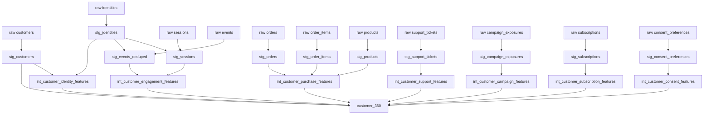

# Customer 360 Lineage

## Important boundaries

- Raw data is never mutated.
- Event duplicates are removed only in staging.
- Anonymous raw activity is preserved; a resolved customer key is added separately.
- Intermediate marts remain domain-specific so each feature family can be reconciled independently.
- `customer_360` is a join of deterministic marts, not a place for hidden business logic.
