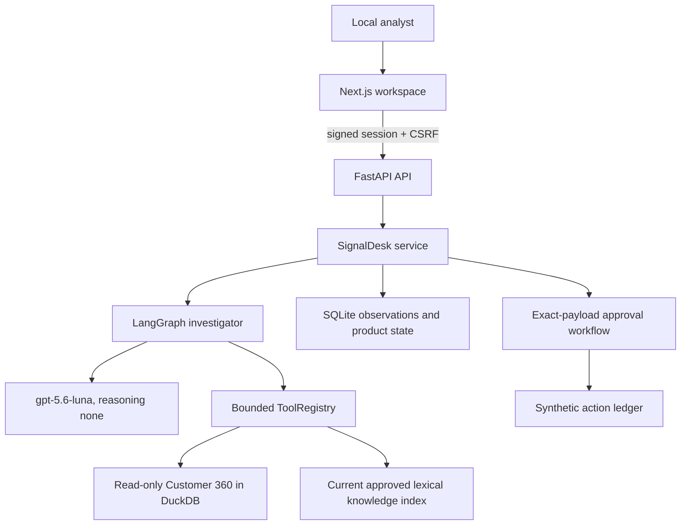
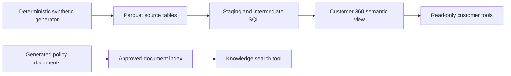
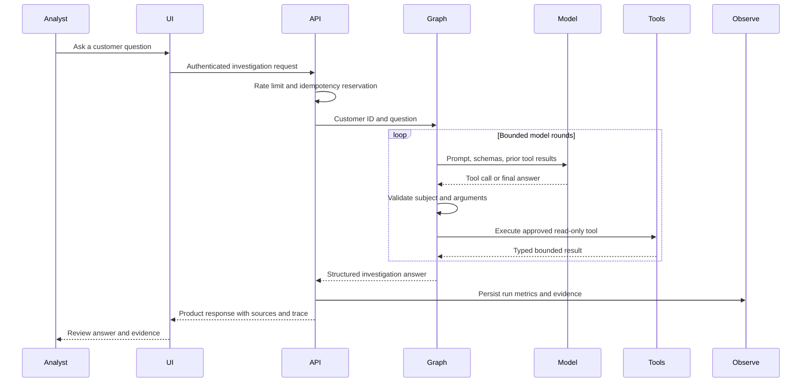
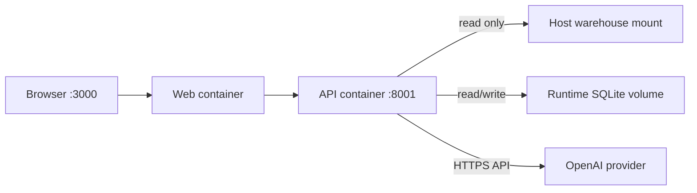

# Architecture

> Learning scope: this architecture runs locally over synthetic data. It
> demonstrates boundaries and tradeoffs, not a production reference design.

## Current serving path



The browser never receives database access, model credentials, unrestricted
tools, or raw internal objects. The model receives only approved tool schemas
and bounded tool results.

## Data path



The generator truth labels stay outside the serving data contract. Customer
facts come from Customer 360; policy claims come from retrieved approved
documents. The model is not asked to calculate revenue, counts, rates, or
eligibility rules.

## Investigation sequence



## Action authority path

The integrated product does not let the investigation agent autonomously pick
and execute a customer action. An analyst drafts a synthetic support follow-up,
reviews the exact payload, and records approve or reject. The durable workflow
binds the decision to an immutable action ID and writes only to a synthetic
ledger.

```text
investigation evidence
  -> analyst-drafted action
  -> exact payload displayed
  -> approve or reject
  -> audited decision
  -> idempotent synthetic write on approval only
```

This is deliberately narrower than the original north-star diagram.

## Historical experiments versus accepted serving choices

| Area | Experiment | Accepted learning-system choice | Reason |
|---|---|---|---|
| Retrieval | pgvector semantic search reached 98% Recall@5 | Lexical current-approved index for the integrated product | Avoid an unused infrastructure dependency for bounded product intents; vector evidence remains valid for broader search. |
| Agent loop | Manual Responses API loop | LangGraph | Explicit state, routing, interruption, and recovery fit the workflow. |
| Runtime alternative | OpenAI Agents SDK approval path | LangGraph retained | Both passed parity; framework fit, not local speed, drove the choice. |
| Actions | Five synthetic action types in CLI experiment | Analyst-drafted support action in UI | Do not claim the model learned business action quality. |
| Persistence | SQLite | SQLite for local learning | Simple durable evidence, explicitly not distributed storage. |

## Deployment shape



Docker Compose provides packaging and local process boundaries. It does not
provide orchestration, autoscaling, multi-zone availability, managed identity,
or an operations platform.

## Architectural decisions that matter

1. **Determinism below probability.** SQL and typed tools own calculations.
2. **Evidence has provenance.** Customer and policy sources stay distinct.
3. **Agency is bounded.** The model selects among narrow read tools and cannot
   receive arbitrary SQL or cross-customer access.
4. **Authority is separate.** A recommendation or draft is not authorization.
5. **Failure is part of the contract.** Timeouts, limits, retries, readiness,
   idempotency, and observations are explicit.
6. **Experiments do not silently become dependencies.** Vector retrieval and
   alternate runtimes remain measured options rather than automatic adoption.

## Where to inspect the implementation

- API: `src/api/`
- agent: `src/agent/` and `src/workflow/`
- tools: `src/tools/`
- retrieval: `src/retrieval/`
- actions: `src/actions/`
- observability: `src/observability/`
- UI: `web/`
- deployment: `Dockerfile.api`, `web/Dockerfile`, `docker-compose.yml`
